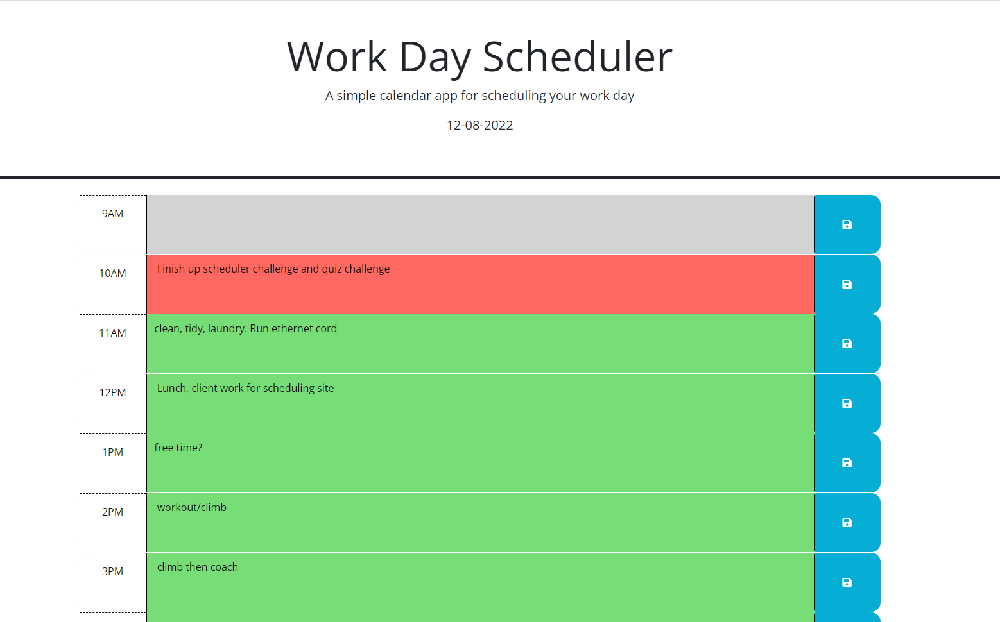

# Challenge 05 - Day Scheduler

## Description

This weeks challenge is to create a day scheduler. When users visit they site, they are presented with the current day and typical work day blocks. A user can then enter text into an hour-long block and save that activity in local storage. Timed blocks will have a visual color change to indicate the current block, upcoming/yet to happen blocks, and time blocks that already passed.

## Deployment

This website is live and can be viewed at the following url:
[https://smithm4949.github.io/scheduler_challenge_05/](https://smithm4949.github.io/scheduler_challenge_05/)

## Example

A screenshot of the app and a schedule taken during the 10am block is included below:

## Authors and acknowledgment

This homework assignment was completed and developed by Myles Smith. Starter code was provided by Trilogy/GWU.

## Project status

This project is feature complete according to the acceptance criteria and there are currently no plans for further development.
